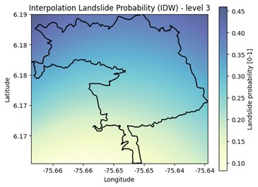

# README

## Project Overview
This repository stores the python code with which the papper: Introducing a Multi-level Regional Framework for Rainfall-Triggered Landslides Prediction was developed. We encourage readers to test the software using the files given in the folder "Input" and other files with the required format.

## License
This project is licensed under the **Creative Commons Attribution 4.0 (CC BY 4.0)**. You are free to use, modify, and share the code as long as proper credit is given to the authors.

### Citation
When using this code, please cite the following manuscript:

**Preliminary reference:**  
Gómez, D., García, E.F., Aristizábal, E., Vega, J., Ospina, M., Arregocés, H.A., & Nery, T. (in preparation). *Introducing a multi-level regional framework for rainfall-triggered landslides prediction*. Unpublished manuscript.

> Note: The final citation may change upon formal publication.

## How to Use

The project's main script is located in the file `main-script.py`.  

This software is designed to provide *Rainfall-triggered landslide prediction* in the Andean zone of Colombia using the Random Forest statistical model. The methodology and results are detailed in the article: *"Introducing a Multi-level Regional Framework for Rainfall-Triggered Landslides Prediction"* (currently in preparation). We encourage you to read the article to better understand the concepts presented.  

The framework consists of three resolution levels:  

1. **Level 1**: The model works with CHIRPS data at a resolution of 0.05° (approximately 5.5 km grid cells for the study area).  
2. **Level 2**: The model works with terrestrial rain gauge measurements at a daily scale, providing a finer spatial resolution compared to Level 1.  
3. **Level 3**: The model uses terrestrial rain gauge measurements at an hourly scale (or finer, e.g., minutes). At this level, the software generates empirical rainfall thresholds based on the specific scenario of the area of interest (depending on soil type and soil moisture). If cumulative rainfall exceeds the defined thresholds, there is a high probability of landslides. These thresholds account for rainfall accumulation over 24 hours and 30 days prior to the event.

**Important Note**:  
The input files required to use the code are located in the `Input-data` folder. The name of each required file is detailed in the script near the corresponding line of code where it is called.  

The code is provided to allow readers to understand the project's development process and adapt it to their needs using the inputs provided in the `Input-data` folder. However, the project deliverable is not the software itself, and it is not designed to work with arbitrary datasets in any region of interest. Ongoing efforts are being made to develop a software product capable of fulfilling these requirements.  

If necessary, users may "skip" resolution levels based on the data available and the resolution that best suits their needs. However, if Level 1 is skipped, the user must run the function `def cargar_archivo` located at line 77.  

The script is structured as follows:  
- **Lines 1–53**: Explanation of the code and required libraries.  
- **Level 1 (Lines 54–183)**:  
   - The model is configured to work with CHIRPS precipitation data at 0.05° resolution.  
   - Users upload CHIRPS rainfall data in the specified format to process the required variables.  
   - Data are standardized and passed through the model.  
   - A CHIRPS grid file for the Andean zone is uploaded, defining the areas where the model will be applied. Grid cells are assigned unique IDs for better processing of rainfall data and delimitation of areas of interest.  
   - Users upload the area of interest for graphical visualization.  
   - Output: A graph like this:  
      

- **Level 2 (Lines 183–457)**:  
   - The process is similar to Level 1 but uses different types of data.  
   - Instead of a CHIRPS grid, users upload a file with defined points for terrestrial rain gauge stations in the Andean zone.  
   - Interpolation methods (IDW or splines) are applied to provide spatial predictions across the area of interest, not just at the rain gauge points.  
     - Note: Splines interpolation requires at least three measurement points.  
   - Output: Probability of rainfall-triggered landslides is displayed, with graphs like these:  
      
      

- **Level 3 (Lines 457–799)**:  
   - This level requires hourly data (or finer temporal resolution).  
   - Empirical rainfall thresholds are calculated for cumulative rainfall over 24 hours and 30 days. If these thresholds are exceeded, there is a high probability of landslides.  
   - Thresholds depend on the scenario for the area of interest:  
     1. Fine soils (silt and clay) during dry periods.  
     2. Fine soils with sand and coarse materials during rainy periods.  
     3. Fine soils during rainy periods.  
   - Output:  
     - Probability of landslides is visualized in a graph (with IDW interpolation):  
         
     - Two additional graphs are generated for the defined thresholds:  
       
       
         

## Contact
For questions or feedback, please contact: gii.grupoudea@gmail.com.

